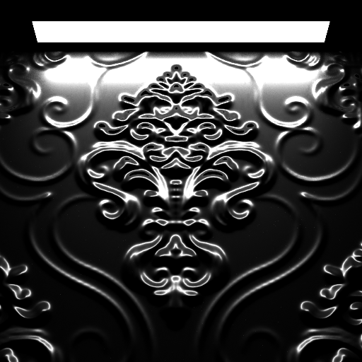

# ray-tracing

# BSDFs and Materials
Implemented BSDFs are shown in the table. Microfacet BSDFs use Smith+GGX model together with the implementation of the sampling of the distribution of visible normals (<a href="https://jcgt.org/published/0007/04/01/">Link</a>).
| Shader | Preview | Shader | Preview |
| --- | --- | --- | --- |
| Diffuse   [Lambertian BRDF](src/bsdfs/lambertian_reflection.hpp) |  | Plastic   [Lambertian BRDF](src/bsdfs/lambertian_reflection.hpp)   [Microfacet BRDF](src/bsdfs/microfacet_reflection.hpp#L37) |  |
| Smooth Mirror   [Specular BRDF](src/bsdfs/specular_reflection.hpp) |  | Rough Mirror   [Microfacet BRDF](src/bsdfs/microfacet_reflection.hpp#L37) |  |
| Smooth Glass   [Specular Glass BSDF](src/bsdfs/specular_glass.hpp) |  | Smooth Glass with Uniform Medium   [Specular Glass BSDF](src/bsdfs/specular_glass.hpp)   [Uniform medium](src/core/medium.hpp#L40) |  |
| Rough Glass   [Microfacet Glass BSDF](src/bsdfs/microfacet_glass.hpp) |  | Rough Glass with Uniform Medium   [Microfacet Glass BSDF](src/bsdfs/microfacet_glass.hpp)   [Uniform medium](src/core/medium.hpp#L40)  |  |

BSDFs can be combined together and they can be parameterized with textures.

<table>
  <tbody align="center">
    <tr>
      <td rowspan=4> <a href="https://sketchfab.com/3d-models/venice-mask-4aace12762ee44cf97d934a6ced12e65">Venice Mask</a></td>
      <td>Basecolor texture </td>
    </tr>
    <tr>
      <td>Metalness texture </td>
    </tr>
    <tr>
      <td>Normal texture </td>
    </tr>
    <tr>
      <td>Roughness texture </td>
    </tr>
  </tbody>
</table>
 
 # Integrators
 - Forward BSDF Inegrators. Performs a random walk starting from the camera and using the BSDF at the intersection points to choose the next direction.
 - Forward MIS Integrator. Same as previous but additionally performing direct lighting at the intersection points.
 - Backward Integrator. Performs a random walk starting from the light source.
 - BDPT Integrator. Builds two subpaths starting from the camera and the light source using random walk and then tries to connect different subpaths prefixes.
 <table>
  <thead>
    <tr>
      <th colspan=2>Result in 1 minute</th>
    </tr>
  </thead>
  <tbody align="center">
    <tr>
      <td> <a href="src/integrators/forward_bsdf_integrator.hpp">Forward BSDF Integrator</a></td>
      <td> <a href="src/integrators/forward_mis_integrator.hpp">Forward MIS Integrator</a></td>
    </tr>
    <tr>
      <td> <a href="src/integrators/backward_integrator.hpp">Backward Integrator</a></td>
      <td> <a href="src/integrators/bidirectional_integrator.hpp">BDPT Integrator</a></td>
    </tr>
  </tbody>
 </table>
 
<table>
  <thead>
    <tr>
      <th colspan=2>Result in 10 minutes</th>
    </tr>
  </thead>
  <tbody align="center">
    <tr>
     <td> <a href="src/integrators/forward_bsdf_integrator.hpp">Forward BSDF Integrator</a></td>
     <td> <a href="src/integrators/forward_mis_integrator.hpp">Forward MIS Integrator</a></td>
    </tr>
    <tr>
     <td> <a href="src/integrators/backward_integrator.hpp">Backward Integrator</a></td>
     <td> <a href="src/integrators/bidirectional_integrator.hpp">BDPT Integrator</a></td>
    </tr>
   </tbody>
 </table>
 
 # Mediums
 Every closed surface can act as a simple medium. Each medium parameterized by refractive index, absorption coefficient and priority. Only a single medium can exist at any given point, the one with the highest priority. Intersection on the medium boundary is reported only when the medium above the boundary differs from the medium below the boundary. 
 In the picture, glass and ice have a priority of two, tea/water/something has a priority of one.
 

 
 # Normal mapping
 
 - Altering shading frame. Construct a new shading frame using old shading tangent and bitangent with shading normal obtained from the normal map. Invalid cases (such as when a vector is in the upper hemisphere around the geometric normal but is in the lower hemisphere aroung geometric normal) are clipped to preserve the symmetry of the light transport.
 - Microfacet-based normal mapping. Idea is to construct a geometrically valid microfacet surface made of two facets per shading point: the one given by the normal map at the shading point and an additional facet that compensates for it such that the average normal of the microsurface equals the geometric normal (<a href="https://blog.unity.com/technology/microfacet-based-normal-mapping-for-robust-monte-carlo-path-tracing">Link</a>).
<table>
  <thead>
    <tr>
      <th></th>
      <th>Diffuse</th>
      <th>Rough Mirror</th>
      <th>Specular Mirror</th>
    </tr>
  </thead>
  <tbody align="center">
    <tr>
      <td>Altering shading frame</td>
      <td></td>
      <td></td>
      <td></td>
    </tr>
    <tr>
     <td><a href="src/bsdfs/normal_mapping.hpp">Microfacet-based normal mapping</a></td>
     <td></td>
     <td></td>
     <td></td>
    </tr>
  </tbody>
</table>
